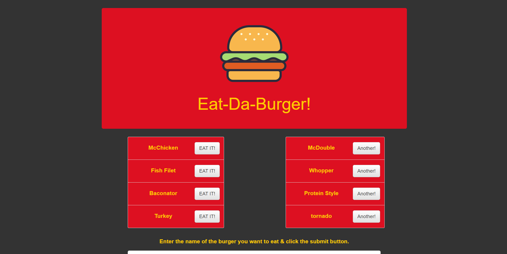

Eat - da - Burger by Esteban Lau Koo
=====
I created a burger logger with a homemade ORM (yum!), MySQL, Node, Express, handlebars using the MVC design pattern.

Used Handlebars to generate HTML.

Node to connect to MySQL database and Express to handle routing.

--app summary--

Eat-Da-Burger! is a fun app that lets a user input the name of a burger they want to eat.

Once submitted, the burger is displayed in text on the left side of the page where it's waiting to be devoured.

Each of the burgers will come with button option to devour the burger and then it will be displayed on the right side where all devoured burgers are

On the right side you will be given an option to also get another of these burgers (for now this is done by just toggling a boolean value and not building a second iteration of the item)

--Links--

Heroku: https://sleepy-basin-63100.herokuapp.com/

